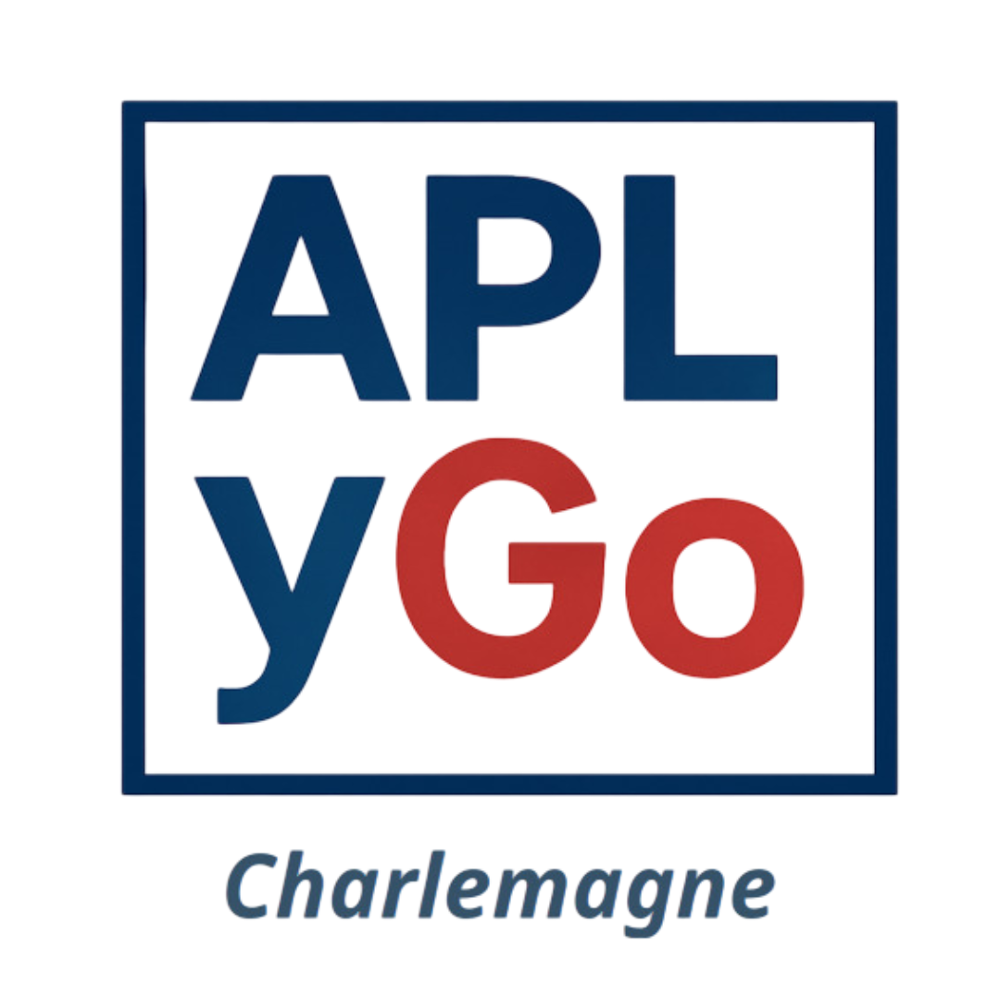

# [APLyGo-Charlemagne](https://secured.moju-apps.fr/aply_go_charlemagne/)

**A dedicated edition of the APLyGo SaaS, tailored for Charlemagne.**

## Overview

[**APLyGo-Charlemagne**](https://secured.moju-apps.fr/aply_go_charlemagne/) is a specific version of the [**APLyGo**](https://secured.moju-apps.fr/aply_go/) cloud-based Software-as-a-Service (SaaS) platform developed by [MOJU-AI](https://moju-apps.fr/).

It retains all the strengths of APLyGo while being **adapted to Charlemagne’s context and workflows**:

- High-performance OCR for accurate text extraction  
- Auditable processes ensuring full traceability  
- GDPR-compliant handling of sensitive data  

## Features

- Accurate recognition of documents, images, and forms relevant to Charlemagne  
- Simplified web interface for non-technical users  
- Secure, compliant, and reliable processing of information  

## Learn More

Visit the [MOJU-AI website](https://moju-apps.fr/) for contact and subscription details.
